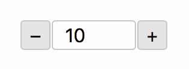

# react-input-numeric

[](https://github.com/smeuli/react-input-numeric/blob/master/LICENSE)
[](https://github.com/smeuli/react-input-numeric/pulls)

**Better number input for React**

* Simple to configure
* Customizable
* Same look across browsers
* Touch screen friendly

→ **[Demo](https://samuelmeuli.github.io/react-input-numeric)**




## Usage

Install the package using NPM:

```
npm install react-input-numeric
```

Add the component to your React application:

```jsx
import InputNumeric from 'react-input-numeric';

// Somewhere in your code:
<InputNumeric
  value={this.state.value}
  onChange={value => this.setState({ value })}
/>
```


## Full example

```jsx
import React, { Component } from 'react';
import InputNumeric from 'react-input-numeric';

export default class ExampleComponent extends Component {
  constructor() {
    super();
    this.state = {
      value: 0
    };
  }

  render() {
    return (
      <InputNumeric
        value={this.state.value}
        onChange={value => this.setState({ value })}
      />
    );
  }
}
```


## Props

Prop | Type | Default | Description
---- | ---- | ------- | -----------
`value` (required) | Number | – | Value currently displayed in the input field
`max` | Number | – | Maximal value
`min` | Number | – | Minimal value
`decimals` | Number (integer) | `2` | Number of digits after the decimal point
`step` | Number | `1` | Difference between the possible values (e.g. `1` only allows integers)
`name` | String | – | HTML `name` attribute to be assigned to the input field
`disabled` | Boolean | `false` | Input should not be editable and buttons not clickable
`showButtons` | Boolean | `true` | Show/hide buttons for incrementing/decrementing
`showTrailingZeros` | Boolean | `false` | Display e.g. `4.00` instead of `4` (with `decimals={2}`)
`snapToStep` | Boolean | `false` | Snap manually entered values to the nearest multiple of `step`
`onBlur` | Function | – | Function to be executed when the component loses focus (current value is passed as parameter)
`onChange` | Function | – | Function to be executed when the value is changed (new value is passed as parameter)
`onFocus` | Function | – | Function to be executed when the input field gets focus (current value is passed as parameter)


## More information

* The value can also be incremented/decremented using the up/down arrow keys
* When setting the `decimals` prop, the exact value is always stored and passed to the `onBlur`, `onChange`, and `onFocus` functions. Only the value displayed to the user is rounded.
* The component uses [decimal.js](https://github.com/MikeMcl/decimal.js/) internally for handling arbitrary-precision decimals


## Development

* `git clone`
* `npm install`
* `npm start` to generate the library bundle using [Rollup](https://github.com/rollup/rollup)
* Open `localhost:3000` to see the component in action using [Storybook](https://github.com/storybooks/storybook)
